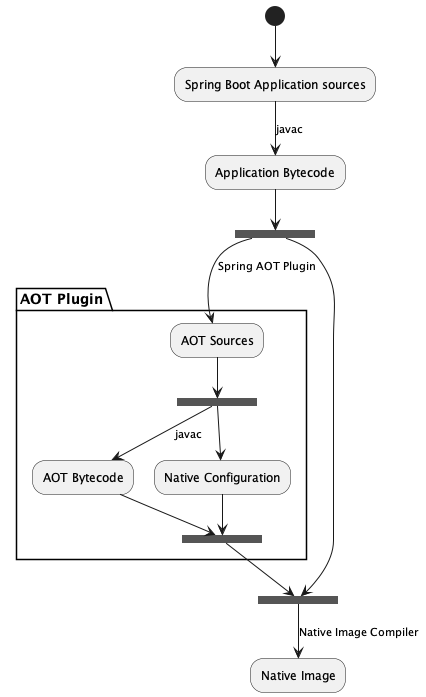

<!-- _backgroundColor: #1a1a1a -->
<!-- _color: white -->

# GraalVM and Spring&nbsp;Native

Aleksandr Barmin
April 2022

---

<!-- _backgroundColor: #1a1a1a -->
<!-- _color: white -->

# Aleksandr Barmin

- Chief Software Engineer I
- Write Java since 2010
- AWS Solution Architect Associate
- AWS Developer Associate

Aleksandr_Barmin@epam.com

---

<!-- _backgroundColor: #1a1a1a -->
<!-- _color: white -->

# Agenda

- What is GraalVM
- Building native images with GraalVM
- Spring Native - all you need to start with
- `@NativeHint` from Spring Native
- Code examples, not so many slides

---

# What is GraalVM?

- High performance JDK distribution
- Core distribution:
  - JVM
  - GraalVM Compiler
  - LLVM and JS runtimes
- Supports Java, JS, Ruby, Python, R, WebAssembly, multiple langs at&nbsp;once

<!--

- GraalVM – a high-performance JDK distribution.
- It is designed to accelerate the execution of applications written in Java and other JVM languages while also providing runtimes for JavaScript, Ruby, Python, and a number of other popular languages. GraalVM’s polyglot capabilities make it possible to mix multiple programming languages in a single application while eliminating any foreign language call costs.
- The LLVM Project is a collection of modular and reusable compiler and toolchain technologies. Despite its name, LLVM has little to do with traditional virtual machines. The name "LLVM" itself is not an acronym; it is the full name of the project.

-->

---

# Getting Started

- Use SDKMan to install GraalVM
- Write a simple Java app, build, run, enjoy

---

# GraalVM Native Image

- AOT compile Java to a standalone executable - platform specific
- Executable includes all the code was available at **image build time**
- Substrate VM provides memory management, GC, thread scheduling, etc ordinary JVM features
- `$ gu install native-image`

<!--

- Native Image is a technology to ahead-of-time compile Java code to a standalone executable.
- The Native Image builder or native-image is a utility that processes all classes of an application and their dependencies, including those from the JDK. It statically analyzes these data to determine which classes and methods are reachable during the application execution. Then it ahead-of-time compiles that reachable code and data to a native executable for a specific operating system and architecture. This entire process is called building an image (or the image build time) to clearly distinguish it from the compilation of Java source code to bytecode.
- This executable includes the application classes, classes from its dependencies, runtime library classes, and statically linked native code from JDK. It does not run on the Java VM, but includes necessary components like memory management, thread scheduling, and so on from a different runtime system, called “Substrate VM”. Substrate VM is the name for the runtime components (like the deoptimizer, garbage collector, thread scheduling etc.).

-->

---

# Closed World Optimizations

- Dynamic Class Loading
- Reflection
- Dynamic Proxy
- Java Native Interface - JNI
- Serialization

---

# Incompatible with Closed-World Optimizations

- `invokedynamic` Bytecode and Method Handles
- Security Manager

---

# Features that may operate differently in Native Images

- Signal Handlers
- Class Initializers
- Finalizers
- Thread methods like `Thread.stop()`
- Unsafe Memory Access
- Debugging and Monitoring

---

<!-- header: Spring Native -->

# Spring Native

Spring Native provides support for compiling Spring-based apps using GraalVM native image compiler

- spring-native
- spring-native-configuration
- spring-native-docs
- spring-native-tools
- spring-aot
- spring-aot-test
- spring-aot-maven/gradle-plugin

---

# Spring AOP

- Prepares `BeanFactory` in order not to configure it during runtime (read `@Configuration` classes, post-processing, etc).
- Generates code based on the configured `BeanFactory`.
- Additional code generation, ex. creation of `reflect-config.json`.

<!--

Spring AOT inspects an application at build-time and generates an optimized version of it. Based on your @SpringBootApplication-annotated main class, the AOT engine generates a persistent view of the beans that are going to be contributed at runtime in a way that bean instantiation is as straightforward as possible. Additional post-processing of the factory is possible using callbacks. For instance, these are used to generate the necessary reflection configuration that GraalVM needs to initialize the context in a native image.

--->

---

# Bean Factory Preparations

- Computation of `@ConditionalOn`-s.
- Profiles evaluation.
- Invoke any `BeanDefinitionRegistryPostProcessor` to create beans declared at runtime.

---

# Code Generation

Based on `RootBeanDefinition` Spring AOT finds a suitable `BeanRegistrationWriter` that will write a code that is responsible for initialization of a bean at runtime.

---

# Native Hints

- `@TypeHint` - for simple reflection
- `@NativeHint` - more complicated cases like field or method-level access
- `BeanFactoryNativeConfigurationProcessor` - good for bean introspection
- `BeanNativeConfigurationProcessor` - to inspect `BeanInstanceDescription` of every bean
- `NativeConfiguration` for hints not related to beans or `BeanFactory`

---

<!-- header: Summary -->

# Summary

- GraalVM provides significant performance boost by converting existing code
- Still requires additional meta information due to the closed world assumption
- Spring Native allows to convert existing Spring app into native image with less efforts

https://github.com/aabarmin/epam-spring-native-example-2022
